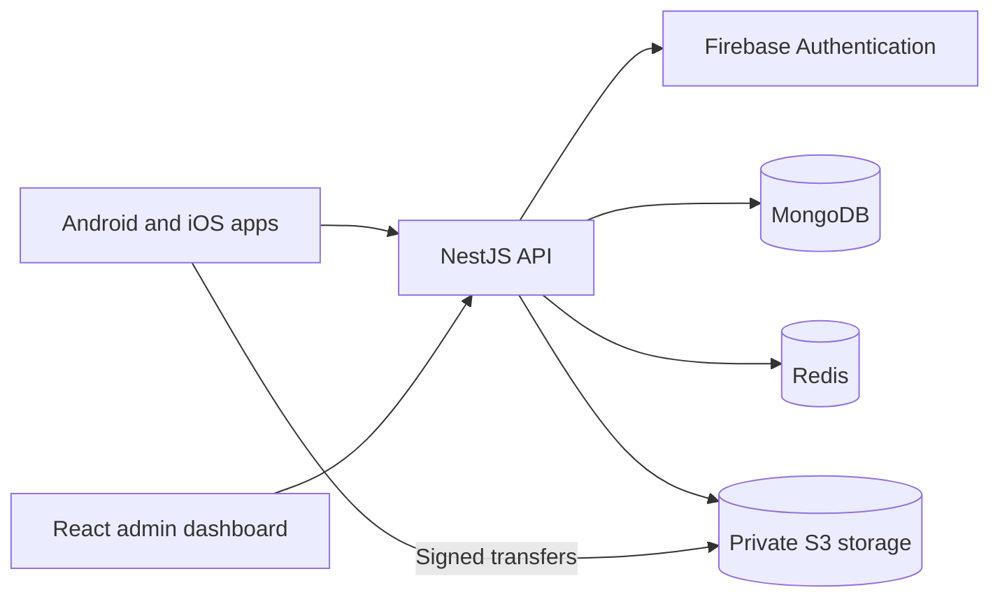

# MusicMute

**Remove background music. Keep the voice.**

MusicMute is an AI-powered audio source separation project with native Android
and iOS apps. Import audio you have permission to process, submit it for vocal
isolation, and play, download, or share the voice-only result.

This repository contains the mobile apps, API, and administrator dashboard.
New audio processing is temporarily unavailable while the processing architecture
is redesigned. Existing job history and completed-result access remain available.

[Getting started](#getting-started) · [Architecture](#architecture) ·
[Documentation](#documentation) · [Contributing](CONTRIBUTING.md) ·
[Report a bug](https://github.com/hatemragab/music_mute/issues/new?template=bug_report.md)

## Features

- **Native mobile apps:** Kotlin/Jetpack Compose on Android and Swift/SwiftUI on iOS.
- **Processing library:** retain job history and completed voice-only results.
- **Private transfers:** authenticated APIs and short-lived S3 upload/download grants.
- **Job coordination:** durable processing state, cancellation, and recovery support.
- **Operations console:** a React dashboard for authorized administrators.
- **Account controls:** Firebase authentication and coordinated account deletion.

## Architecture



| Component       | Technology                             | Setup and details                 |
| --------------- | -------------------------------------- | --------------------------------- |
| Android app     | Kotlin, Jetpack Compose                | [android/](android/README.md)     |
| iOS app         | Swift, SwiftUI                         | [ios/](ios/README.md)             |
| API             | NestJS, TypeScript, MongoDB, Redis, S3 | [backend/](backend/README.md)     |
| Admin dashboard | React, TypeScript, Vite, Tailwind CSS  | [dashboard/](dashboard/README.md) |

## Getting started

```sh
git clone https://github.com/hatemragab/music_mute.git
cd music_mute
```

Choose the component you want to work on; there is no root-level install command.

1. **API:** install Node.js 24 and pnpm 10, and provide independently running
   MongoDB 8 and Redis 7.4 or later. Follow the [backend setup](backend/README.md)
   to configure an ignored local environment file, then run
   `pnpm install --frozen-lockfile` and `pnpm run start:dev` from `backend/`.
2. **Dashboard:** follow the [dashboard setup](dashboard/README.md) for its API
   origin and Firebase configuration. Administrator access requires backend
   authorization.
3. **Mobile apps:** use JDK 17 and Android SDK 36 for Android, or macOS and Xcode
   for iOS. Configure Firebase and the API endpoint using the platform guides
   before building.

Start with the component guides for exact environment variables and verification
commands. Local builds and fixture tests do not establish that production
authentication, storage, or notifications are configured.

## Processing and account behavior

Both apps make local audio import the primary flow. Selected audio is reviewed with
an explicit rights confirmation before upload and processing. YouTube remains a
secondary feature with an explicit download action; original downloads stay private.
New processing submissions currently return `PROCESSING_UNAVAILABLE`. The processed
library retains job history and retrieves completed voice-only MP3 output on demand. See the
[mobile processing tracker](docs/tasks/mobile-audio-processing.md) for implementation
status, local test results and separate live-service validation requirements.

Account deletion is available in both apps with recent authentication, an exact
15-day recovery deadline, durable request recovery, and account-scoped local
cleanup. The backend immediately blocks new costly work, fences active work, and
coordinates storage and identity deletion after the deadline. Public
`/delete-account` and `/privacy` pages require
operator-supplied publication settings. See the [implementation and validation record](docs/validation/2026-09-10-store-readiness.md)
and [deletion operations guide](docs/account-deletion.md).

Both apps use `com.hatem.musicmute`. This replaces the earlier development ID
`com.hatem.vocal`; the operating systems treat them as separate apps, so old
private downloads and settings are not migrated automatically.

## Administrator dashboard

The [dashboard](dashboard/README.md) uses React Router, TanStack Query,
Tailwind CSS, shadcn/ui, and Firebase Web Authentication against the NestJS
administration API. It is an operations console, not a public demo.

Its CapRover package reads public browser configuration from environment variables
at container startup and excludes `.env` files. Production setup requires the
dashboard domain in Firebase Authentication, its origin in the API CORS allowlist,
and an API version exposing the administration routes. See the
[dashboard task package](docs/tasks/full-dashboard/dashboard/README.md) and
[validation record](docs/validation/full-dashboard-local.md) for recorded evidence
and remaining integration requirements.

## Firebase

Both native apps are registered in Firebase project `music-mute` using
`com.hatem.musicmute`. The Firebase CLI's `apps:create` and `apps:sdkconfig`
commands handle registration and configuration downloads; `firebase init` is
not needed for this native app setup.

- Android app: `1:412717301830:android:0914d9b1a4c7f4d2a9ca47`.
  Configuration: `android/app/google-services.json`. The Google Services Gradle
  plugin supplies resources and Firebase's initialization provider starts the
  default app automatically. Firebase Android BoM 34.18.0 manages Firebase Common.
- iOS app: `1:412717301830:ios:29c661efe91a5b76a9ca47`.
  Configuration: `ios/Vocal/GoogleService-Info.plist`, included in the app target.
  FirebaseCore 12.18.0 is pinned through Swift Package Manager and initialized at
  app startup. `ios/project.yml` remains the Xcode project source of truth.

The apps integrate Firebase Authentication and optional Firebase Messaging.
Messaging registration depends on notification permission and successful backend
device/session synchronization; iOS also requires APNs provisioning/token setup.
Client SDK integration does not establish live provider configuration or delivery.
YouTube downloads and original history remain local; processing storage uses the
backend's short-lived signed S3 grants.

The production Android and iOS configuration files are local-only and ignored by
Git. They contain client identifiers that are shipped in the apps and therefore
cannot be treated as secrets; restrict their API keys to the registered package,
certificate fingerprints, and bundle ID. Never force-add these files. The
emulator-only Android `authE2e` configuration is a checked-in synthetic fixture.
Do not add service-account keys, Admin SDK credentials, or CLI login tokens to the
repository.

To inspect the registrations or refresh configuration files from the repository root:

```sh
firebase apps:list --project music-mute
firebase apps:sdkconfig ANDROID 1:412717301830:android:0914d9b1a4c7f4d2a9ca47 --project music-mute --out android/app/google-services.json
firebase apps:sdkconfig IOS 1:412717301830:ios:29c661efe91a5b76a9ca47 --project music-mute --out ios/Vocal/GoogleService-Info.plist
```

Run these commands before native builds in a fresh checkout. Supply Admin SDK,
AWS, database, Redis, SMTP, and signing credentials only through ignored local
files or the deployment platform's secret/environment settings.

## Validate Android

With JDK 17 and Android SDK 36 configured:

```sh
cd android
./gradlew :app:assembleDebug :app:lintDebug :app:testDebugUnitTest
```

## Validate iOS

Open `ios/MusicMute.xcodeproj` in Xcode. See [iOS setup and test commands](ios/README.md)
for the authorized iPhone 17 Pro simulator and the opt-in real download test.

## Validate the API and dashboard

From `backend/`, run `pnpm install --frozen-lockfile` followed by
`pnpm run verify`. Infrastructure
integration suites have additional requirements documented in the backend guide.

From `dashboard/`, run `npm ci`, then:

```sh
npm run format:check
npm run lint
npm run typecheck
npm test
npm run build
```

Browser and deployment checks are documented in the dashboard guide; browser
integration tests also require local MongoDB, Redis, and Google Chrome.

## Documentation

| Guide                                                              | Contents                                                  |
| ------------------------------------------------------------------ | --------------------------------------------------------- |
| [Backend](backend/README.md)                                       | Local environments, API verification, and VPS preparation |
| [Audio API](backend/docs/api/audio-processing.md)                  | Mobile history and unavailable-boundary contracts         |
| [Audio operations](backend/docs/operations/audio-processing.md)    | Storage and retained-job operations                       |
| [Dashboard](dashboard/README.md)                                   | Administrator setup, checks, and packaging                |
| [Account deletion](docs/account-deletion.md)                       | Identity and storage cleanup operations                   |
| [Mobile processing tracker](docs/tasks/mobile-audio-processing.md) | Implementation status and validation boundaries           |
| [Contributing](CONTRIBUTING.md)                                    | Change scope, local checks, and pull requests             |

## Contributing and feedback

Use [GitHub issues](https://github.com/hatemragab/music_mute/issues) for reproducible
bugs and focused feature requests. Include the affected component and sanitized
diagnostics. Read [CONTRIBUTING.md](CONTRIBUTING.md) before opening a pull request.

Process only audio you own or have permission to use. YouTube support is a
secondary download flow and does not grant rights to download or process content.

## License

This repository does not currently include a root license file. The backend
package is marked `UNLICENSED`; this README does not grant additional permissions.
Third-party libraries and models retain their respective licenses.
