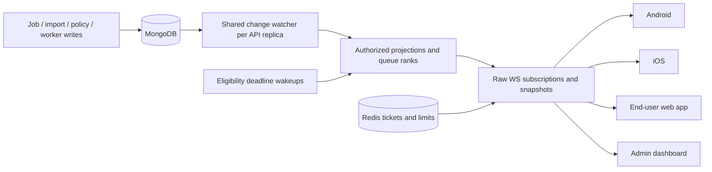

# Realtime processing queue: study and proposed design

Status: local implementation and validation completed; release/environment limits
are recorded in the implementation ledger. Studied 2026-09-26.
Current execution status and evidence: [IMPLEMENTATION.md](IMPLEMENTATION.md).
Initial study base: remote `origin/main`, commit `2d4d8ba00dac212ea55a0f4e73e736a4e4a0b05e`.
Updated base: freshly fetched `origin/main`, `29a98542` (fast-forward merged on
2026-09-26); includes the end-user web client. Web source findings updated below.
Branch: `hatem/realtime-processing-queue`.

## Outcome and scope

Show each job's current queue position and automatically update its status, processing
progress, timing, cancellation, errors, and result availability. Replace periodic
processing reads and Refresh controls with raw RFC 6455 WebSocket subscriptions on
Android, iOS, and the React end-user web client. Also retain the planned realtime
job views for the separate administrator dashboard. No Socket.IO or SSE.

The repository has native Kotlin/Compose and Swift/SwiftUI apps, not Flutter apps.
The requested end-user web app is now present in `web-client/`, brought in by the
main merge. It is distinct from `dashboard/`, with owner-scoped Firebase auth,
EN/AR UI, local audio uploads and URL imports. No new app is needed. This resolves
the original web-client scope question.

“All refreshing” here includes job detail, visible processing history, active URL
import tracking, and processing usage/availability shown alongside those screens.
All web polling is now in scope: dashboard overview, workers/diagnostics, health,
alerts, recovery badges/lists and APK verification as well as jobs. Explicit
reads and mutation read-backs will be reviewed separately from recurring polling.
The full inventory and additional tasks are in IMPLEMENTATION.md. HTTP remains for authentication, explicit commands, upload/download
grants and transfers. Existing HTTP reads remain compatible with older clients;
new processing screens receive their initial and recovery snapshots through WS.
Opening a history page or changing its filter sends a subscription command, not a
repeated HTTP fetch. No automatic HTTP polling fallback in the new clients.

## Source findings

Paths below are relative to the repository root. Original findings use the initial
base; end-user web findings use the updated base.

| Area                          | Source                                                                                                                                   | Observed behavior / implication                                                                                                                                                                                                                            |
| ----------------------------- | ---------------------------------------------------------------------------------------------------------------------------------------- | ---------------------------------------------------------------------------------------------------------------------------------------------------------------------------------------------------------------------------------------------------------- |
| Actual processing scheduler   | `backend/src/worker-fleet/claims/worker-claim.service.ts`, `oldestEligibleCandidate` and `claim`                                         | MongoDB transactions; `(queuedAt, _id)` ascending; recipe/slot eligibility, retry readiness, remaining attempts, input, execution ownership, machine/policy fences. Skips owners whose admission fails.                                                    |
| Owner admission               | `backend/src/admin-settings/processing-admission.service.ts`, `claimProcessingSlot`                                                      | Requires active account, effective policy, reserved processing allowance and capacity from the job's admission snapshot. Touches account fences: it cannot be called as a harmless rank lookup.                                                            |
| Capacity                      | `backend/src/jobs/job-lifecycle-policy.ts`                                                                                               | Upload reservations are not ready queue entries. `interrupted` and `cancel_requested` still consume processing capacity.                                                                                                                                   |
| Retry ordering                | `backend/src/worker-fleet/attempts/worker-attempt.service.ts`, `backend/src/worker-fleet/leases/worker-recovery.service.ts`              | Automatic retries reset `queuedAt` and set `nextAttemptAt`; time passing can change eligibility without another database write.                                                                                                                            |
| Existing user response        | `backend/src/jobs/jobs.presenter.ts`                                                                                                     | Has timing and progress; no queue position. Do not make the optional legacy `workerAvailable` field mandatory.                                                                                                                                             |
| Existing admin response       | `backend/src/admin-jobs/admin-jobs-query.service.ts`, `admin-jobs.presenter.ts`                                                          | Has `queuePosition`, but supplies `null` deliberately. The web UI currently renders null as “Not queued”, which confuses unknown with absent.                                                                                                              |
| Revisions                     | `backend/src/jobs/job.schema.ts`, `worker-attempt.service.ts:updateProgress`                                                             | Lifecycle revision and admin CAS revision have different purposes. Progress changes use attempt/sequence and do not increment lifecycle revision. Queue position can change when another job changes. Neither existing revision alone is a stream version. |
| Existing WS                   | `backend/src/worker-hints/worker-hint.service.ts`, `backend/src/main.ts`                                                                 | Existing `ws` dependency; single-use Redis tickets, worker-only channel. Rejects Origin and rejects upgrades to every other path. Adding an independent upgrade listener would conflict. Hint sequence is process-local and publishing is best effort.     |
| Other queue                   | `backend/src/url-imports/import-runtime.ts`, `imports.service.ts`, `import-processor.ts`                                                 | BullMQ schedules URL acquisition, not vocal processing. Keep the queues distinct. Durable import records cover acquisition until a processing job is submitted.                                                                                            |
| Android history               | `android/app/src/main/java/com/hatem/musicmute/processing/JobHistoryController.kt`                                                       | Foreground 10-second polling with backoff, list/detail reads, cache, account epochs and pagination. Preserve those ownership fences and cache behavior.                                                                                                    |
| Android URL imports           | `android/app/src/main/java/com/hatem/musicmute/processing/UrlImports.kt`                                                                 | Separate 3-second detail loop; ambiguous create recovery shares this loop and must survive its replacement.                                                                                                                                                |
| iOS history                   | `ios/Vocal/State/ProcessingHistoryModel.swift`                                                                                           | Foreground 10-second polling with backoff and account generations.                                                                                                                                                                                         |
| Native controls               | Android `ui/ProcessingDetailScreen.kt`, `ProcessingHistoryScreen.kt`; iOS `UI/ProcessingDetailView.swift`, `ProcessingHistoryView.swift` | Refresh buttons on both platforms and pull-to-refresh on iOS.                                                                                                                                                                                              |
| Web                           | `dashboard/src/features/jobs/job-detail-page.tsx`, `jobs-page.tsx`, `app/query-client.ts`                                                | Detail timer uses 20 seconds; list also uses visible polling. Global focus refetch is enabled. Mutation invalidation triggers more reads. Remove all of these for migrated processing queries.                                                             |
| End-user web jobs             | `web-client/src/jobs/JobsUI.tsx`                                                                                                         | Owner-keyed infinite history polls every 5 seconds and detail every 4 seconds while visible/active. List Refresh and broad owner mutation invalidations also trigger reads.                                                                                |
| End-user web imports / upload | `web-client/src/home/HomePage.tsx`, `AudioUpload.tsx`                                                                                    | Separate import polling and submitted-import navigation; successful import/upload invalidates jobs. Preserve handoff and upload semantics while replacing those refresh paths.                                                                             |
| End-user web shared state     | `web-client/src/library/LibraryPage.tsx`, `auth/AuthProvider.tsx`, `main.tsx`, `settings/SettingsPage.tsx`                               | Library and Home share `useJobs`; auth clears query cache and fences asynchronous bootstrap by generation. Preserve owner-scoped favorites/hidden items and playback while updating jobs and usage.                                                        |
| End-user web policy           | `web-client/server.mjs`, `src/api/types.ts`, `src/api/client.ts`                                                                         | CSP allowlists exact HTTPS API/media origins but no WSS origin. Job type needs queue/timing fields; wire conversion and installation-scoped authentication must be preserved.                                                                              |
| Network / configuration       | `android/app/build.gradle.kts`, Android `auth/AuthApiClient.kt`, `ios/project.yml`, `dashboard/server.mjs`                               | Android min SDK 26 and HTTP uses HttpURLConnection; no declared OkHttp client. iOS targets 17+. Web CSP currently has `connect-src 'self' https:` and needs explicit approved WSS origin.                                                                  |

The primary checkout contains extensive uncommitted stage-timing work across the
same backend, worker and clients. It was not copied or modified. Before implementation,
reconcile that work with the then-current remote base; do not duplicate or overwrite
its stage presentation. Some README statements describe the older processing-disabled
architecture, so runtime source was used for scheduler findings. No live environment
or production configuration was inspected.

## Queue position semantics

Recommend a **job position**, not an account position. One user may have several jobs.
Position is a one-based rank among currently dispatch-eligible waiting jobs in the
same recipe, ordered by `(queuedAt, _id)`. `jobs_ahead = position - 1`. Running jobs
are excluded. The rank is exact for that defined snapshot, but does not promise
actual start order across parallel slots and overlapping recipe capabilities.

Examples: A running, B/C waiting in the same recipe means B is #1 and C is #2.
If B is cancelled, C becomes #1. An older upload reservation or delayed retry does
not push C backwards. Two simultaneously available workers can claim B and C;
neither client should display a fake intermediate countdown.

Preserve current claim scheduling. Extract shared pure eligibility definitions
and a read-only, batched admission projection; retain all transactional fences in
claims. Do not simulate a claim by invoking `claimProcessingSlot`, and do not
decrement another owner's quota to calculate a position. Validate parity between
the projection and claim eligibility with fixtures and concurrency tests.

Proposed additive `queue` projection:

| Field                    | Meaning                                                                                                                   |
| ------------------------ | ------------------------------------------------------------------------------------------------------------------------- |
| `state`                  | `waiting`, `blocked`, `not_queued`, or `unavailable`                                                                      |
| `position`, `jobs_ahead` | Positive rank / nonnegative count only for eligible waiting jobs; otherwise null                                          |
| `scope`                  | `recipe` for ranked jobs; clients need no private recipe/model details                                                    |
| `reason`                 | Safe enum such as `account_capacity`, `retry_backoff`, `processing_paused`, `worker_unavailable`; no other users' details |
| `as_of`                  | Server snapshot time; freshness is independently tracked by the connection                                                |

Reason precedence: not queued first; invalid/missing eligibility data becomes
unavailable; then policy/account restriction, retry delay, owner capacity, worker
availability; otherwise waiting. Match existing read-access policy for restricted
accounts; deny and clear data if access itself is revoked. A compatible busy worker
does not make the queue unavailable. If no compatible healthy permitted worker
exists, show the wait reason and no dispatch position until capacity returns.
Position #1 means first waiting in this recipe, not “will start immediately.”

Changes in any preceding job, owner capacity, policy, reservation, machine/slot
eligibility, or retry deadline must invalidate affected positions. Schedule bounded
server-side deadline wakeups for retry readiness, worker liveness, expiring policy
restrictions and progress freshness. Rebuild deadlines after restart. This is
server state maintenance, not per-client polling.

Batch ranks per dirty recipe and reuse the result across subscribed owners; do
not execute a count query per socket per update or persist a changing ordinal into
every job. Use a consistent read snapshot for rank membership and owner capacities.
Query only required fields, bound execution time/memory, measure indexes with explain,
and coalesce invalidations. If the configured rank calculation budget is exceeded,
send `unavailable`, never a fabricated or silently partial rank.

## Proposed architecture

Use one shared MongoDB change feed per API replica over an explicit collection
allowlist. Every replica receives committed changes and routes only to its local
subscriptions; this avoids treating a Redis consumer group as a broadcast system.
Include jobs, imports, account/session access, processing policy/overrides/usage,
worker fleet policy, machines and slots. Filter irrelevant heartbeat/cleanup fields
before expensive projections. Production topology and change-stream permissions
must be verified; the repository already requires a replica set for transactions.

This is preferred to adding best-effort publishes to every writer: there are many
transactional and bulk update paths, including account deletion and recovery.
MongoDB change events cover committed writes even if the writing API process crashes.
Do not send raw MongoDB documents to clients. Treat events as invalidations and
read current authorized projections. `updateLookup` can describe a newer document
than the original event; it is not a historical revision payload.

The feed must be established before accepting live subscriptions. On transient
failure, immediately mark clients stale, resume with the feed token, and reconcile
all local subscriptions before declaring live. On expired token, overflow, deletion
of the watched namespace or unrecoverable gap, reset the stream epoch and rebuild
snapshots. Persistent client replay/event history is unnecessary for this state UI:
every reconnect receives a fresh snapshot. If production cannot support change
streams, the alternative is a transactional outbox with a durable dispatcher;
that is a design change, not a silent Pub/Sub fallback.

Existing Redis Pub/Sub remains appropriate for worker wake hints, but cannot be the
only correctness mechanism for a client UI without polling: delivery is at-most-once.
Do not replace the worker claim/lease protocol or remove its reconciliation.

## Authentication and wire protocol proposal

These are proposed names, not implemented API contracts.

1. Add authenticated `POST /realtime-tickets` for owners and
   `POST /admin/realtime-tickets` for authorized administrators. Reuse existing
   Firebase session validation, account access and permission services. Tickets
   are single-use, 30-second TTL, stored as a digest in Redis, no-store responses.
2. Connect to `/realtime/socket` with subprotocol `musicmute.realtime.v1` plus
   `ticket.<opaque-ticket>`. Consume atomically and select only the version protocol
   in the response. Bind ticket to principal, session/access version, audience and
   expected browser Origin. Never put Firebase tokens/tickets in URLs or logs;
   redact protocol headers in proxy, tracing and error reporting.
3. Centralize HTTP upgrade routing in one dispatcher. Route worker hints unchanged
   to their own handler and client traffic to its handler; reject unknown paths once.
   Browser requests require an exact configured Origin match. Native tickets permit
   absence of Origin; absence is not an authorization bypass. Reject `Origin: null`.
4. Authenticate and authorize again before initial snapshot and each subscription.
   Owners can request only their own jobs/imports/history/usage. Admin tickets require
   `jobs.read` and project fields according to current permissions, including
   `media.read` and `users.read`. Never reuse the admin presenter for owners.
5. Observe access/session/role changes and close revoked sessions promptly. Bound
   connection age by authenticated session/token validity and periodically revalidate
   authorization on the server. Reconnect obtains a fresh ticket. Fail closed on
   uncertain authorization; do not rely on a one-hour ticket lifetime for revocation.

Client messages: `subscribe`, `unsubscribe`, `resync`, application `pong`.
Subscriptions have an ID plus validated scope: owner history page, job detail,
import detail, processing usage/availability, or permitted admin jobs page/detail.
Use the existing bounded filter/cursor semantics. A page subscription receives a
complete replacement page and next cursor; changes at page boundaries invalidate
subsequent pages and replace them through WS. Never silently append out-of-scope
items or retain a deleted row. Bound loaded page subscriptions and detail IDs.

Server messages: `snapshot`, `subscription_error`, `session_revoked`, `ping`,
`resync_required`. A snapshot contains `protocol_version`, `stream_id`,
`subscription_id`, monotonic `sequence`, `server_time`, and the complete authorized
payload. Reuse snake_case wire serializers explicitly: Nest HTTP interceptors do
not automatically serialize raw WS messages. Keep commands and media outside WS.

For v1, full replacement snapshots are simpler than partial entity patches. Each
subscription has a serialized producer: register invalidations first, load a
consistent snapshot, send it, then rerun if dirtied during the read. Never allow
overlapping reads to send an older state later. Discard reads from old subscription
generations. Send monotonically ordered snapshots; ignore duplicates/old stream IDs
on the client and request resync on a sequence gap. A new stream resets sequence.
HTTP mutation responses must not overwrite a live subscription with an older read;
they acknowledge commands while WS supplies current presentation state.

Initial limits to validate under load: 30-second heartbeat / 60-second stale timeout,
10-second connect/snapshot timeout, 64 KiB incoming control frames, 256 KiB outgoing
frame cap, 1 MiB per-socket buffered output cap, bounded page sizes and subscriptions,
and distributed per-account/IP connection and ticket budgets. Count connections with
expiring Redis leases across replicas; native sessions and browser tabs need a
documented usable allowance. Disable compression initially. Coalesce progress/rank
updates to at most one per second per subscription; terminal states flush immediately.
Chunk oversized snapshots with snapshot ID and atomic client replacement, or reject
an oversized request with a recoverable error; never truncate silently.

Close slow consumers with a documented retryable code and force a new snapshot.
Heartbeats include server time/feed health; an open TCP connection alone is not
“Live.” Reconnect uses jittered exponential backoff (1–30 seconds), pauses offline,
and honors ticket endpoint Retry-After. Unauthorized stops retries until session
recovery. Define all error/close codes in the protocol before implementation.

## Client integration and UI

Each app has one session-owned connection, shared by screens. Keep account epochs,
cache ownership and cancellation fences. Subscribe while foregrounded and relevant;
close/suspend on background and resnapshot on return. Push notifications remain a
background signal; they do not prove a current state and must not start a permanent
background socket. Native operating systems may suspend apps.

Android: a small OkHttp WebSocket adapter is the proposed necessary dependency;
verify/pin an SDK-26-compatible version during implementation. Existing HTTP transport
and transfers remain. “Raw” means standard WebSocket frames without Socket.IO, not
writing a TLS/framing implementation. Replace the history loop and URL-import detail
loop. Preserve idempotent import creation and uncertain upload/cancel/retry recovery.

iOS: use `URLSessionWebSocketTask`, a session-owned coordinator and MainActor state
application. Replace `ProcessingHistoryModel` polling and refresh controls. iOS has
no current link-import entry UI; the stream must support imported jobs and future
import subscriptions without silently adding a new import product feature.

End-user web (`web-client/`): use browser `WebSocket` under the signed-in session,
sharing subscriptions among Home, Jobs, detail and Library. Replace the 5-second
history, 4-second detail and separate import timers. Keep the existing owner-keyed
infinite-page cache, auth generation fences, installation ID, EN/AR styling and
playback queue. Add queue/timing/connection types to `src/api/types.ts`; decode WS
snake_case explicitly. Replace upload/import/mutation invalidation reads with stream
convergence, including the submitted-import-to-job navigation race. Derive the exact
WSS origin from validated runtime API configuration in `server.mjs`; keep media and
Firebase CSP permissions intact. Do not add PWA/offline mode, local video intake or
browser push as part of this feature. Cached content during a transient disconnect
is not an offline product guarantee. Account recovery and verification refresh
controls remain outside processing scope.

Admin web (`dashboard/`): use browser `WebSocket`, an authenticated provider, and explicit TanStack Query
cache updates. Disable timers, focus/reconnect/mount HTTP refetch and HTTP mutation
invalidations for migrated queries. Re-subscribe when filters/pages change; preserve
admin revision CAS for commands. Configure exact API WSS origin in CSP and validate
proxy upgrade/idle timeout behavior in the eventual deployment.

| Situation                     | Presentation                                                                                  |
| ----------------------------- | --------------------------------------------------------------------------------------------- |
| Preparing / uploading locally | Existing local progress; no queue number yet                                                  |
| Eligible and waiting          | **#4 in queue**; “3 jobs ahead”; compact live indicator                                       |
| First in recipe queue         | **#1 in queue**; “Waiting for a processing slot”                                              |
| Owner capacity reached        | “Waiting for your current job to finish”                                                      |
| Retry delay                   | “Waiting to retry”; no artificial rank                                                        |
| No compatible worker / paused | “Waiting for processing capacity” / “Processing paused”                                       |
| Processing                    | Existing stage/progress UI; queue block disappears                                            |
| Initial connection            | Small loading state, then server snapshot                                                     |
| Reconnecting / offline        | Keep last content, label “Reconnecting…” / “Offline — last updated …”; dim or hide stale rank |
| Ready / failed / cancelled    | Immediate final state and existing appropriate actions                                        |

Remove Refresh buttons and processing pull-to-refresh. Automatic reconnection is the
normal recovery; an optional **Reconnect** action retries the connection only, not
an HTTP status refresh. Preserve meaningful Retry processing, Cancel, Play and Save
actions. Never start downloading merely because a ready event arrives. Keep scroll,
playback and selection stable as snapshots update. EN/AR localization, RTL, plural
forms (including Arabic), large text and screen-reader announcements are required.
Announce important transitions, not every progress tick; respect reduced motion.
Do not display fabricated ETA, progress increments, or other users' information.

## Reliability, rollout and acceptance

Target under defined local/staging load: committed changes reach foreground clients
within 2 seconds at p95; reconnect snapshot within 3 seconds after authentication
and healthy dependencies. These are acceptance targets, not measured results.
Measure change-feed lag, snapshot latency, rank query cost, active connections,
reconnects, buffer pressure and rejected subscriptions without private payloads.

Roll out backend additively, then clients after protocol/fault tests. Old clients
continue using existing HTTP reads. If realtime is unavailable, new clients show a
stale/reconnecting state without enabling hidden polling. Keep the old client release
available for an explicit rollback; never remove old endpoints in this feature.

Test snapshot/subscribe races, progress without lifecycle revision changes, job
creation from another device, rename/deletion, filter membership, multiple jobs per
owner, retries, simultaneous claims, compatible/incompatible recipes, policy changes,
quota release, worker loss, account revocation, two API replicas, stalled sockets,
Mongo/Redis outages, resumption-token loss, proxy timeout and background/resume.
Steady-state network assertions must show zero periodic job/import reads and no
per-event “WS hint -> HTTP GET” pattern. Check command idempotency separately.

Device/UI testing is restricted to the existing iPhone 17 Pro / iOS 26.0 simulator
`3CC14436-EC3C-4419-A079-C84951E5FA07`. Android JVM tests, lint and builds can run,
but Android device UI validation is blocked under the current target restriction;
do not substitute an emulator/phone. Browser automation covers the web dashboard.
Implementation and local tests are authorized. Deployment, commit, push and
production mutation still require an explicit request.

## External references checked

- [MongoDB change streams](https://www.mongodb.com/docs/manual/changestreams/): committed change feed, resume tokens, and current-document lookup caveats.
- [Redis Pub/Sub](https://redis.io/docs/latest/develop/pubsub/): at-most-once delivery; insufficient as the sole recovery mechanism.
- [WHATWG WebSockets](https://websockets.spec.whatwg.org/): browser constructor accepts URL and protocols, with browser-controlled handshake headers.
- [Apple URLSessionWebSocketTask](https://developer.apple.com/documentation/foundation/urlsessionwebsockettask): native iOS transport reference; verify exact API behavior during implementation.

The implementation backlog and verification gates are in [TASKS.md](TASKS.md).
